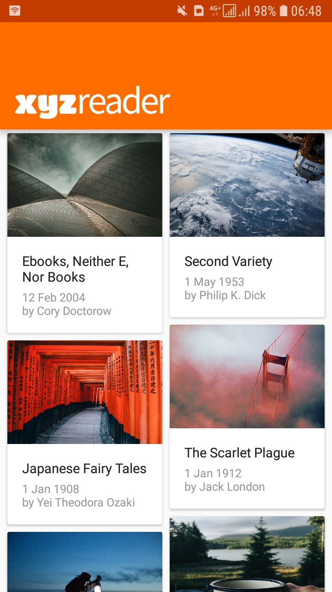
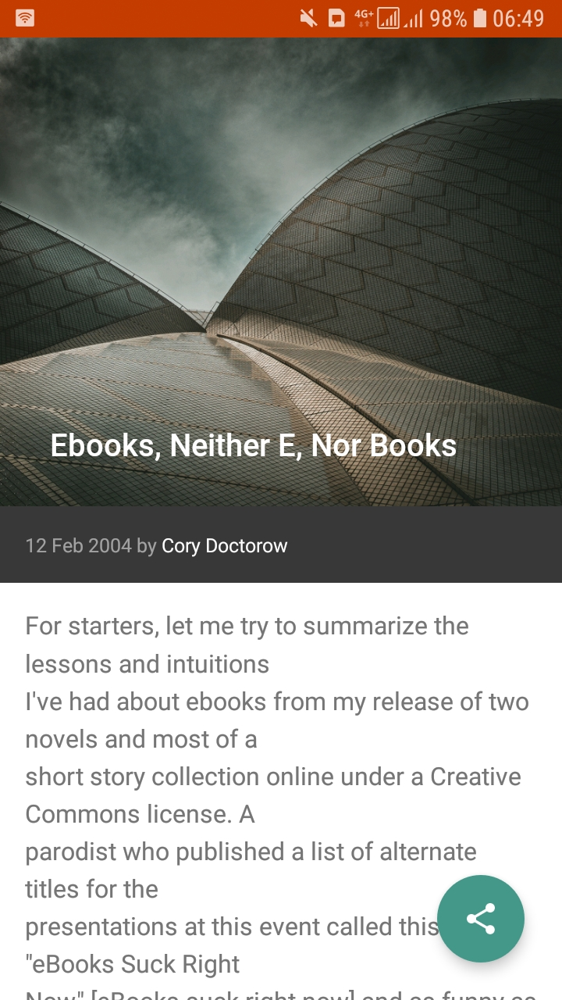
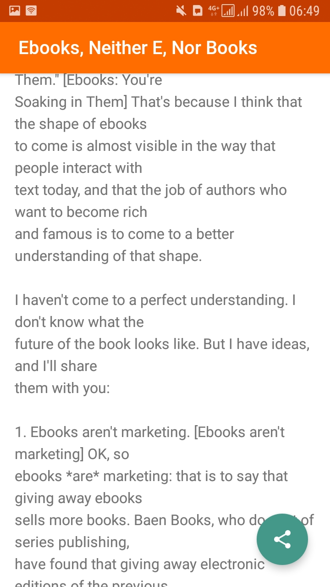

# XYZ Reader Starter Code

An Android Mock RSS Client

## Installation
Clone this repository and import into **Android Studio**
```bash
git clone https://github.com/EddyMM/xyz-reader.git
```

## Screenshots

      

## Maintainers
This project is maintained by:
* [Eddy mwenda](https://github.com/EddyMM)


## Contributing

1. Fork it
2. Create your feature branch (git checkout -b my-new-feature)
3. Commit your changes (git commit -m 'Add some feature')
4. Push your branch (git push origin my-new-feature)
5. Create a new Pull Request


